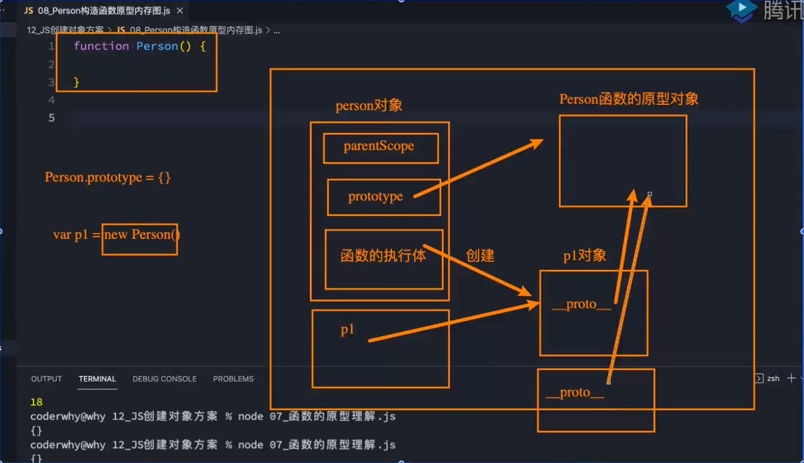
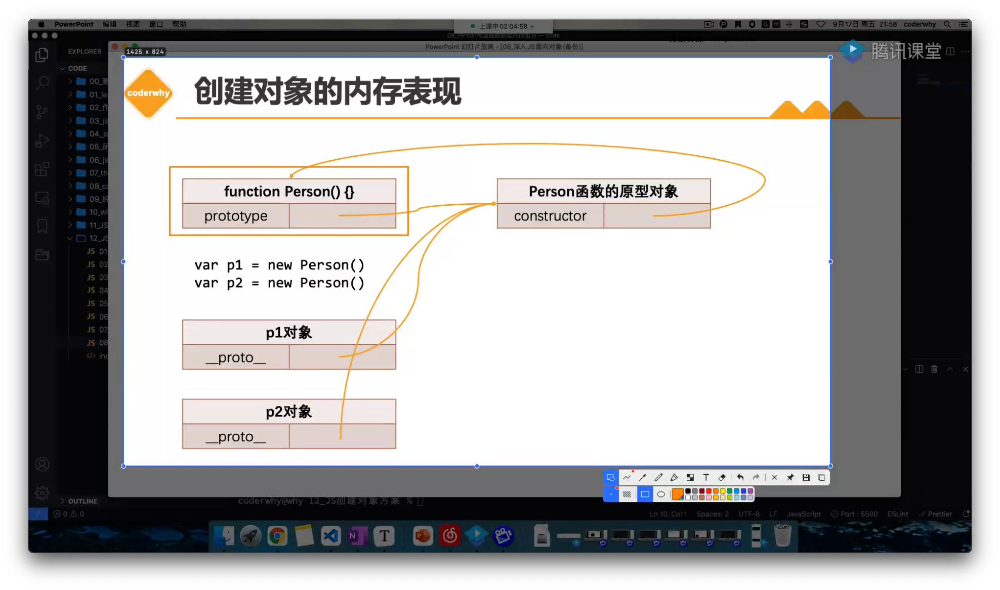

# 07_(掌握)构造函数创建对象内存表现

> `2:27:19`


|本期版本|上期版本
|:---:|:---:
`Fri Jan 20 21:56:15 CST 2023` | -


```javascript
function foo(){

}
// 函数也是一个对象

new Function()
console.log(foo.__proto__) // 隐式原型

// 显式原型
foo.prototype
```



