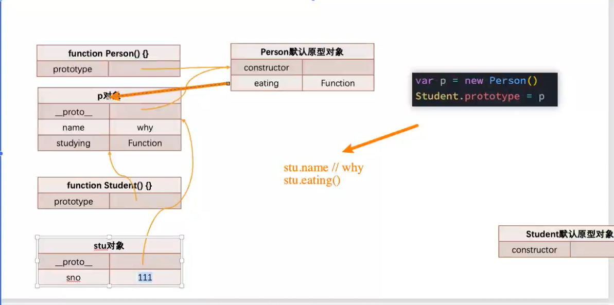

# 07_(掌握)继承-原型链实现继承的方案

> ``


|本期版本|上期版本
|:---:|:---:
`Fri Jan 20 21:56:15 CST 2023` | -


```javascript
function Person(){
}
Person.prototype.eating = function(){
	console.log(this.name + " eating~")
}


function Student(){
}

var p = new Person()
Student.prototype = p

Student.prototype.studying = function(){
	console.log(this.name + "studing~")
}

var stu = new Student()
```




